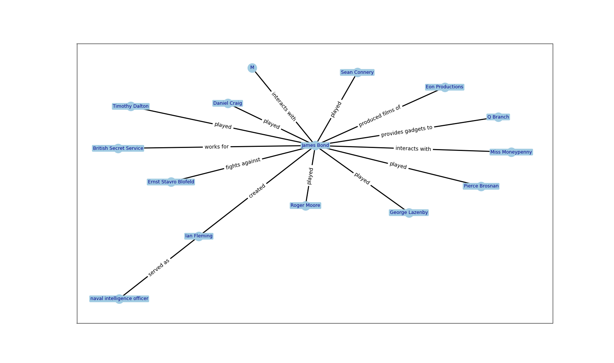

# Experiment with Graph RAG

## Overview
In this experiment, I am trying to recreate a basic Graph RAG structure similar to the LLM Graph Transformer from LangChain.
This code does the following:
- Extract entities and relationships as nodes and edges using a structured LLM output using Pydantic.
- Return nodes and edges as a `RelationshipModel` object
- Visualize the output using the networkx library and matplotlib

[]

## Try it out
Before you begin, make sure you have the following installed on your system:

1. **Clone the Repository**
   First, clone the repository from GitHub to your local machine. Open your terminal and run:
   ```sh
   git clone https://github.com/Lucamiras/graph_rag_experiment.git
   ```

2. **Navigate to local repository**
   Navigate to your local repository using the interface or via the terminal:
   ```sh
   cd repository-name
   ```

3. **Install requirements**
   Install dependencies from the requirements.txt file:
   ```sh
   pip install -r requirements.txt
   ```

4. **Insert a text**
   Open `src/globals.py` and place a text to parse into the `text` variable.

5. **Run main file**
   Run the main file:
   ```sh
   python main.py
   ```
